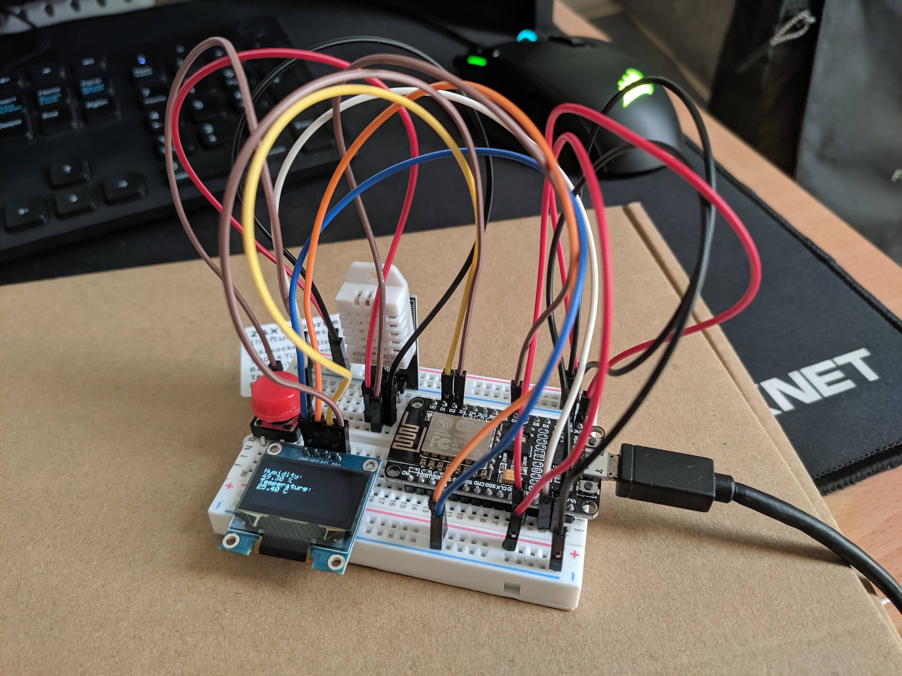
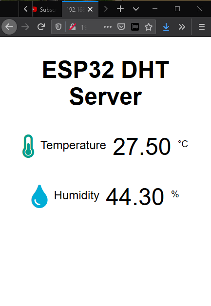

## MicroPython and the Internet of Things

Notes:

    $ python3 -m venv venv

Activate the virtual environment:

    $ source venv/bin/activate
    $ (venv) $ _

If you are using Windows, the activation command is:

    $ venv\Scripts\activate
    $ (venv) $ _

Install required dependencies:

    $ (venv)$ pip install esptool rshell

Connect to the interactive shell:

    $ (venv) $ rshell -a --port <your board serial port name>

Use the `repl` command to interact with the shell in real time.

## ESP8266 OLED Display DHT22 Web Server – Temperature and Humidity using Arduino IDE

Code available on chapter 5 (C++).

Final product:

Web server:

Schematics for the board:

